# Working-With-Helm-Chart

# Introduction To Helm Charts

Helm is a powerful package manager designed for Kubernetes, simplifying the deployment and management of applications within Kubernetes clusters. It allows developers and operators to package, configure, and deploy applications using pre-configured templates called **charts**.

---

### **Key Features of Helm**
1. **Charts**: Helm packages are called charts, which contain YAML configuration files and templates to define Kubernetes resources.
2. **Dependency Management**: Helm automatically handles dependencies between charts.
3. **Version Control**: Helm tracks versions of charts and releases, making upgrades and rollbacks seamless.
4. **Repositories**: Helm charts are stored in repositories, such as Bitnami, which provide pre-packaged charts for popular applications.
5. **Ease of Use**: Helm simplifies complex Kubernetes deployments by reducing the need for writing detailed YAML manifests.

---

### **How Helm Works**
- **Helm CLI**: The command-line tool (`helm`) is used to interact with Helm.
- **Charts**: Charts are the packaging format for Helm, containing templates and configuration files.
- **Releases**: When a chart is deployed, Helm creates a release, which is a specific instance of the chart running in the cluster.

---

## Overview

In this project,we will deploy a simple web application in a kubernetes cluster using Helm. This project covers using Helm charts,customizing deployments with templates and values,installing and running helm and integrating helm into a basic CI/CD process.


---

## **Helm Installation**

### **Step-by-Step Helm Installation for Linux Users**

**Pre-Installation**

Follow this link to complete the download and installation of **vscode**  [download vscode](https://code.visualstudio.com/download)

**Open Your vscode**
 - Run your vscode as an administrator
 - Access your CLI by opening the Terminal

  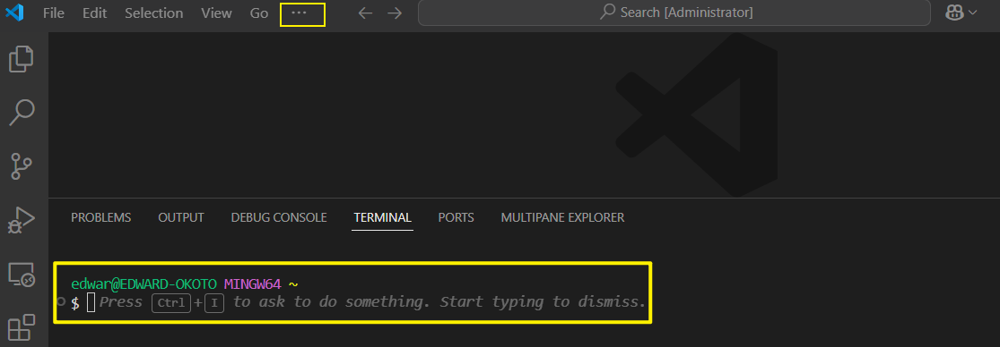


#### **1. Download Helm**
Begin by downloading the latest Helm release:

For Linux
```bash
curl -LO https://get.helm.sh/helm-v3.12.0-linux-amd64.tar.gz -o helm.tar.gz
```

For macOs

```bash
curl -L https://get.helm.sh/helm-v3.5.0-darwin-amd64.tar.gz -o helm.tar.gz
```

- **What does this do?**
  - `curl`: Fetches files from a URL.
  - `-LO`: Ensures the file is downloaded to your current directory.
  - Replace `v3.12.0` with the latest version listed on the [Helm Releases Page](https://github.com/helm/helm/releases).
  - `-o helm.tar.gz` option specifies the output file name
    - `-o`: This flag tells `curl` where to save the downloaded content instead of displaying it directly in the terminal.
    - `helm.tar.gz`: This is the name of the file where the downloaded content will be stored. In this case, you're saving the Helm archive (`.tar.gz`) as `helm.tar.gz`.


#### **2. Extract the Helm Archive**
Once downloaded, extract the compressed `.tar.gz` file:
```bash
tar -xvzf helm.tar.gz
```
- **Explanation:**
  - `tar -xvzf`: Unpacks the archive (`x` for extract, `v` for verbose, `z` for gzip, `f` specifies the file).
  - After extraction, a directory named `helm` will appear, containing the Helm binary.

#### **3. Move the Helm Binary**
To make Helm accessible from anywhere, move the binary to a directory in your system’s PATH:

For Linux

```bash
sudo mv linux-amd64/helm /usr/local/bin/helm
```

For macOs

```bash
sudo mv darwin-amd64/helm /usr/local/bin/helm
```


- **What does this do?**
  - Moves the `helm` file to `/usr/local/bin`, a common location for system-wide binaries.
  - `sudo` is required because `/usr/local/bin` needs administrator privileges.

#### **4. Verify the Installation**
Check if Helm is installed and operational:
```bash
helm version
```
You should see details about the Helm version and build, confirming a successful installation.

#### **5. Clean up**

```bash
rm helm.tar.gz && rm -r *-amd64
```

---

**Alternatively**: Install helm on macOS using `Homebrew`

#### **Step-by-Step Helm Installation for macOS Users**

#### **Using Homebrew**
Homebrew is the easiest way to install Helm on macOS.

1. Install Helm:
   ```bash
   brew install helm
   ```
2. Verify the installation:
   ```bash
   helm version
   ```
   - **Why Homebrew?**
     - It’s a package manager for macOS that simplifies software installation, updates, and removal.

---

#### **Step-by-Step Helm Installation for Windows Users**

**Open Your vscode**
 - Run your vscode as an administrator
 - Access your CLI by opening the Terminal

  

#### **Option 1: Using Chocolatey**
Install Chocolatey [chocolatey](https://chocolatey.org/) : **Chocolatey** is a package manager for Windows that simplifies software installation, updates, and management via the command line. It automates tasks and handles dependencies efficiently, making it ideal for developers and IT professionals.

If you have Chocolatey installed: 
1. Install Helm:
   ```powershell
   choco install kubernetes-helm
   ```
2. Verify the installation:
   ```powershell
   helm version
   ```

#### **Option 2: Using Scoop**
Alternatively, if you use Scoop:
1. Install Helm:
   ```powershell
   scoop install helm
   ```
2. Check the version:
   ```powershell
   helm version
   ```

#### **Option 3: Manual Installation**
1. **Download Helm**:
   - Go to the [Helm Releases Page](https://github.com/helm/helm/releases) and download the latest `.zip` file for Windows.

2. **Extract the File**:
   - Extract the `.zip` archive using tools like WinRAR or 7-Zip.
   - Locate the `helm.exe` file.

3. **Add Helm to PATH**:
   - Move `helm.exe` to a folder included in your system PATH, or manually add its location to PATH.
   - Restart your terminal to apply changes.

4. **Verify the Installation**:
   - Open Command Prompt or PowerShell:
     ```powershell
     helm version
     ```
        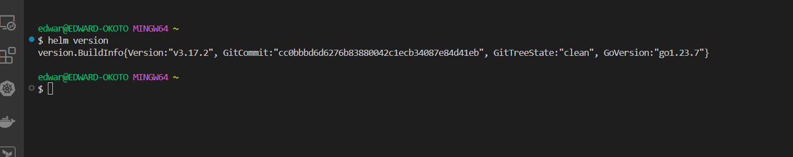
---
## **Create a New Helm Chart**

1.**Create  Project Directory**

```
mkdir helm-web-app

cd helm-web-app
```
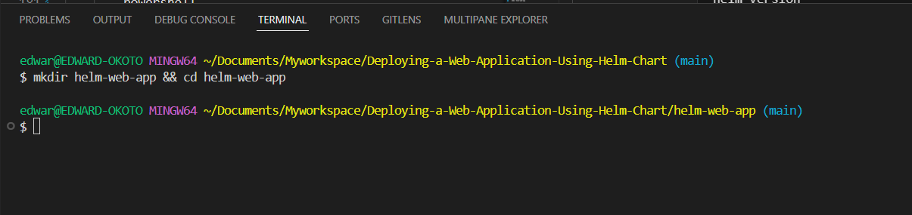

2.**Create a New Chart**

```bash
helm create webapp
```
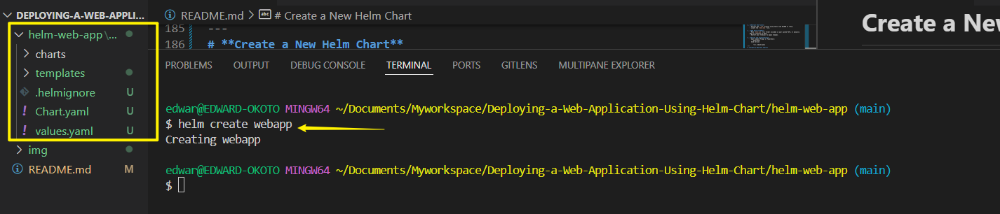

3.**Initialize a git repository**

```
git init
git add .
git commit -m "Initial Helm webapp chart"
```

4.**Push to Remote Repository**

```
git push
```

---

# Customize Helm Chart

Helm charts, values, and templates are the core components of Helm, a Kubernetes package manager. 

---

#### **1. Helm Charts**
A Helm chart is a collection of files that define Kubernetes resources for deploying an application. It simplifies the deployment process by bundling all necessary configurations into a reusable package.

#### **Structure of a Helm Chart**
- **Chart.yaml**: Contains metadata about the chart, such as its name, version, and description.
- **values.yaml**: Defines default configuration values for the chart.
- **templates/**: Contains template files that generate Kubernetes manifests based on the values provided.
- **charts/**: Holds dependencies for the chart.
- **README.md**: Provides documentation for the chart.

Charts can be used to deploy simple applications (e.g., a single pod) or complex ones (e.g., a web app stack with databases and caches).

---

#### **2. Values**
The `values.yaml` file is used to define default configuration values for a Helm chart. These values can be overridden during deployment to customize the application for different environments (e.g., development, staging, production).

#### **How Values Work**
- **Default Values**: Specified in `values.yaml`.
- **Override Values**: You can override defaults using a custom values file or command-line flags:
  ```bash
  helm install my-release my-chart --values=my-values.yaml
  ```
- **Dynamic Configuration**: Values are passed to templates to dynamically generate Kubernetes manifests.

---

#### **3. Templates**
Templates are files in the `templates/` directory that use Go's templating language to generate Kubernetes manifests. They allow you to create dynamic configurations based on the values provided.

##### **How Templates Work**
- Templates use placeholders like `{{ .Values.key }}` to insert values from `values.yaml`.
- They support conditional logic, loops, and functions for advanced customization.
- Example template for a Kubernetes Deployment:
  ```yaml
  apiVersion: apps/v1
  kind: Deployment
  metadata:
    name: {{ .Values.name }}
  spec:
    replicas: {{ .Values.replicas }}
    template:
      spec:
        containers:
        - name: {{ .Values.containerName }}
          image: {{ .Values.image }}
  ```

---

#### **How They Work Together**
1. **Chart**: Provides the structure and files needed for deployment.
2. **Values**: Supplies configuration data to customize the deployment.
3. **Templates**: Dynamically generate Kubernetes manifests using the values provided.

---

### Exploring the `webapp` Directory of our project
- Navigate to the `webapp` directory created by Helm,inside,you will find
    - `chart.yaml`: Contains metadata about the chart such as name,version and description.
    - `values.yaml`: Provides configuration values that helm will inject into the template.Here you set default configuration values.
    - `templates/`: Contains the template files that will generate kubernetes manifest files.These templates references the values defined in the `values.yaml`

```
cd webapp/

ls
```

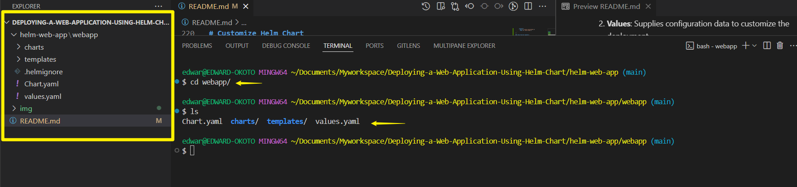


### Modify `values.yaml`

- Open `values.yaml` in a text editor
 
    ```
    vi values.yaml
    ```

- Set the image to use the Nginx stable version

    ```
    replicaCount: 2

    image:
    repository: nginx
    tag: stable
    pullPolicy: IfNotPresent
    ```

    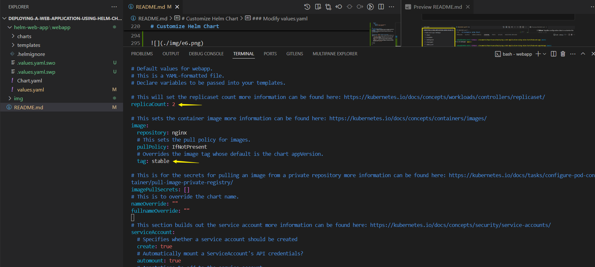


- The configuration will deploy two replicas (`replicaCount: 2`) of the Nginx server.

- Save changes.


### Customize the  `templates/deployment.yaml`

- Open the `deployment.yaml` file in the `templates/` directory.

    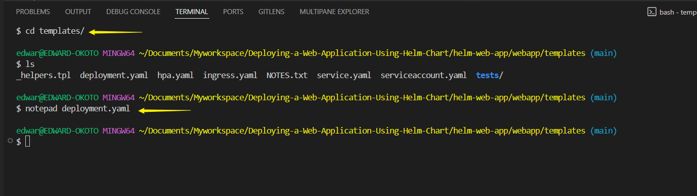

- Remove the line below from under  `spec.template.spec.containers.resources`

    ```
    {"{- toYaml .Values.resources | nindent 12 "}}
    ``
- Add a simple resource request and limit under `spec.template.spec.containers.resources`.This helps kubernetes manages resources efficiently.
 
    ```
    resources:
    requests:
        memory: "128Mi"
        cpu: "100m"
    limits:
        memory: "256Mi"
        cpu: "200m"
    ```
- These settings specify that the deployment should request 128Mi of memory and 100m of CPU but it wont use more than 236mi of memory and 200m of CPU.

- Save the file after making changes.

    ```
    apiVersion: apps/v1
    kind: Deployment
    metadata:
    name: {{ include "webapp.fullname" . }}
    labels:
        {{- include "webapp.labels" . | nindent 4 }}
    spec:
    {{- if not .Values.autoscaling.enabled }}
    replicas: {{ .Values.replicaCount }}
    {{- end }}
    selector:
        matchLabels:
        {{- include "webapp.selectorLabels" . | nindent 6 }}
    template:
        metadata:
        {{- with .Values.podAnnotations }}
        annotations:
            {{- toYaml . | nindent 8 }}
        {{- end }}
        labels:
            {{- include "webapp.labels" . | nindent 8 }}
            {{- with .Values.podLabels }}
            {{- toYaml . | nindent 8 }}
            {{- end }}
        spec:
        {{- with .Values.imagePullSecrets }}
        imagePullSecrets:
            {{- toYaml . | nindent 8 }}
        {{- end }}
        serviceAccountName: {{ include "webapp.serviceAccountName" . }}
        {{- with .Values.podSecurityContext }}
        securityContext:
            {{- toYaml . | nindent 8 }}
        {{- end }}
        containers:
            - name: {{ .Chart.Name }}
            {{- with .Values.securityContext }}
            securityContext:
                {{- toYaml . | nindent 12 }}
            {{- end }}
            image: "{{ .Values.image.repository }}:{{ .Values.image.tag | default .Chart.AppVersion }}"
            imagePullPolicy: {{ .Values.image.pullPolicy }}
            ports:
                - name: http
                containerPort: {{ .Values.service.port }}
                protocol: TCP
            {{- with .Values.livenessProbe }}
            livenessProbe:
                {{- toYaml . | nindent 12 }}
            {{- end }}
            {{- with .Values.readinessProbe }}
            readinessProbe:
                {{- toYaml . | nindent 12 }}
            {{- end }}
            resources:
                requests:
                memory: "128Mi"
                cpu: "100m"
                limits:
                memory: "256Mi"
                cpu: "200m"
            {{- with .Values.volumeMounts }}
            volumeMounts:
                {{- toYaml . | nindent 12 }}
            {{- end }}
        {{- with .Values.volumes }}
        volumes:
            {{- toYaml . | nindent 8 }}
        {{- end }}
        {{- with .Values.nodeSelector }}
        nodeSelector:
            {{- toYaml . | nindent 8 }}
        {{- end }}
        {{- with .Values.affinity }}
        affinity:
            {{- toYaml . | nindent 8 }}
        {{- end }}
        {{- with .Values.tolerations }}
        tolerations:
            {{- toYaml . | nindent 8 }}
        {{- end }}
        
    ```

- Commit and Push changes

    ```
    git add .
    git commit -m "Customized Helm chart"
    git push
    ```

# Deploying Your Application

1. **Deploy With Helm** : Navigate to the root of the project directory `helm-web-app`

    Deploy the application on kubernetes using the below command

    ```
    helm install my-webapp ./webapp
    ```

    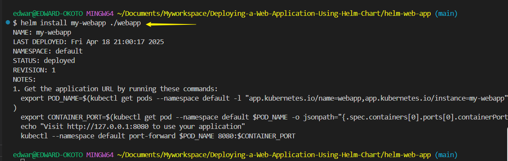

2. **Check Deployment** : 

    ```
    kubectl get deployments
    ```

    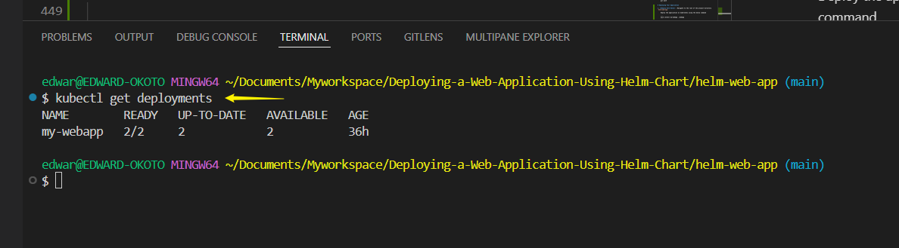

3. **Visit Application URL** :

    ```
    export POD_NAME=$(kubectl get pods --namespace default -l "app.kubernetes.io/name=webapp,app.kubernetes.io/instance=my-webapp" -o jsonpath="{".items[0].metadata.name"}")

    export CONTAINER_PORT=$(kubectl get pod --namespace default $POD_NAME -o jsonpath="{".spec.containers[0].ports[0].containerPort"}")

    kubectl --namespace default port-forward $POD_NAME 8081:$CONTAINER_PORT
    ```


This series of commands is designed to set up **port-forwarding** for a specific Kubernetes pod in the `default` namespace. Here's a step-by-step breakdown of what each command does:

---
##### **1. Set the Pod Name**
```bash
export POD_NAME=$(kubectl get pods --namespace default -l "app.kubernetes.io/name=webapp,app.kubernetes.io/instance=my-webapp" -o jsonpath="{.items[0].metadata.name}")
```
- This command retrieves the name of the pod that matches the specified labels:
  - **`app.kubernetes.io/name=webapp`**: Looks for pods with the label `webapp`.
  - **`app.kubernetes.io/instance=my-webapp`**: Filters further to the specific instance.
- It uses the `jsonpath` filter to extract the pod name from the metadata.
- The result is stored in the `POD_NAME` environment variable for further use.

---

##### **2. Set the Container Port**
```bash
export CONTAINER_PORT=$(kubectl get pod --namespace default $POD_NAME -o jsonpath="{.spec.containers[0].ports[0].containerPort}")
```
- This retrieves the container's exposed port within the pod. Specifically:
  - It queries the `default` namespace for the pod stored in `POD_NAME`.
  - It accesses the `spec.containers[0].ports[0].containerPort` field to extract the first container port.
- The extracted port number is stored in the `CONTAINER_PORT` environment variable.

---

##### **3. Set Up Port Forwarding**
```bash
kubectl --namespace default port-forward $POD_NAME 8081:$CONTAINER_PORT
```
- This forwards traffic from **localhost:8081** to the container's port within the pod:
  - **`8081`**: The local port on your machine.
  - **`$CONTAINER_PORT`**: The container port within the pod (from the previous command).
- Effectively, this allows you to access the containerized application running inside Kubernetes via `localhost:8081`.

---

##### **Use Case**
This process is typically used during **development and testing** to interact with Kubernetes workloads locally without exposing services externally.

visit http://127.0.0.1:8081 to use your application.

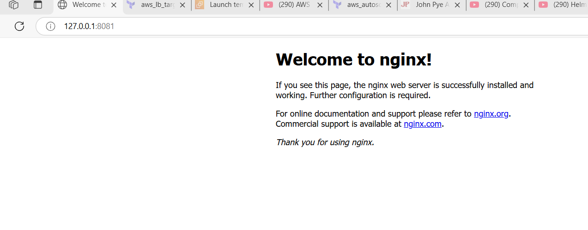

# Integrating Helm With Jenkins

### 1.**Jenkins Setup**
 Guide to downloading, installing, and setting up Jenkins, including the **Java dependency** 

---
##### **Step 1: Install Java**
Jenkins requires Java to run. Follow these steps to install a supported version of Java (Java 11 or Java 17 is recommended):

1. **Download Java**  
   - Visit [Oracle](https://www.oracle.com/java/technologies/javase-downloads.html) or [OpenJDK](https://openjdk.org/install/).
   - Choose the Java Development Kit (JDK) for your operating system.

2. **Install Java**  
   - Run the downloaded installer and follow the installation wizard.
   - Note the installation directory (e.g., `C:\Program Files\Java\jdk-11`).

3. **Set Up PATH**  
   - Add the `bin` directory to your system's PATH environment variable:
     - Open **System Properties** > **Advanced** > **Environment Variables**.
     - Under **System Variables**, edit `PATH` and add:
       ```
       C:\Program Files\Java\jdk-11\bin
       ```

4. **Verify Java Installation**  
   Open Command Prompt or PowerShell and run:
   ```bash
   java -version
   ```
   You should see the installed Java version.

---

##### **Step 2: Download Jenkins**
- Go to the official Jenkins website: [Jenkins Downloads](https://www.jenkins.io/download/).
- Choose the installer suitable for your operating system:
  - For **Windows**: `.msi` file.
  - For **Linux**: Install via repository.
  - For **macOS**: Homebrew or `.war` file.

---

##### **Step 3: Install Jenkins**
##### **For Windows:**
1. Run the `.msi` installer.
2. Follow the setup wizard and choose the default settings.
3. Jenkins will install as a Windows service, allowing it to start automatically.

##### **For Linux:**
1. Install Jenkins via the repository (example for Debian/Ubuntu):
   ```bash
   sudo apt update
   sudo apt install jenkins
   ```
2. Start Jenkins:
   ```bash
   sudo systemctl start jenkins
   ```

##### **For macOS:**
1. Install Jenkins using Homebrew:
   ```bash
   brew install jenkins-lts
   ```
2. Start Jenkins:
   ```bash
   brew services start jenkins-lts
   ```

---

##### **Step 4: Start Jenkins**
For `.war` installations, use the following command:
```bash
java -jar jenkins.war
```

---

##### **Step 5: Access Jenkins**
1. Open your browser and navigate to:
   ```
   http://localhost:8080
   ```
2. Unlock Jenkins using the initial admin password:
   - **Windows**: Locate the password in `C:\Program Files\Jenkins\secrets\initialAdminPassword`.
   - **Linux/macOS**: Run:
     ```bash
     sudo cat /var/lib/jenkins/secrets/initialAdminPassword
     ```

---

##### **Step 6: Complete Setup**
1. Install **recommended plugins**.
2. Create an admin user account.
3. Jenkins is ready to use!
---

### 2.**Determine Helm Binary Path**
- The full binary path of Helm is required in the Jenkins pipeline script.
- To find it, use
  - Linux/macOS: `which helm`
  - Windows: `Get-Command helm | Select-Object -ExpandProperty Source` 

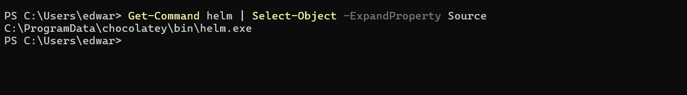

### 3.**Create a Jenkins Pipeline**
- In jenkins, create a new pipeline job
- Set the pipeline source as the Git repository you pushed your code to.
- Configure the pipeline to trigger a build on commit to your repository.

---

##### **Steps Recap**

##### **Step 3: Create a Jenkins Pipeline**
1. **Create Pipeline Job**:
   - Open your Jenkins dashboard and click **New Item**.
   - Select **Pipeline**, name your job, and click **OK**.

   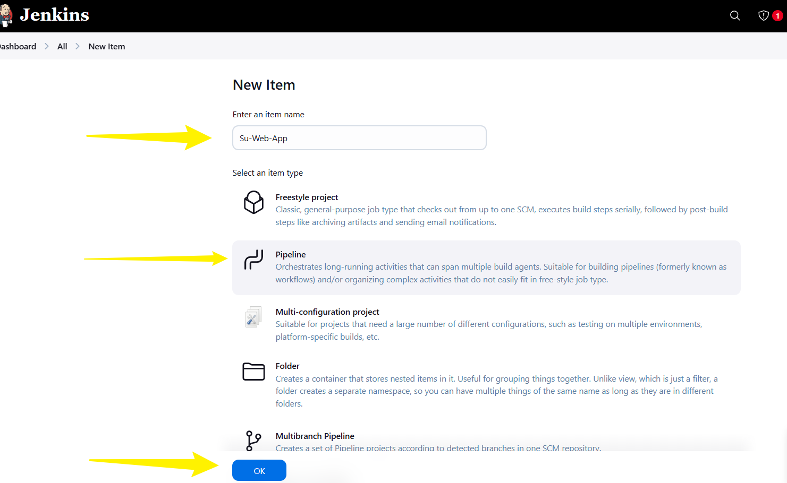

2. **Set Git Repository as Pipeline Source**:
   - Under **Pipeline**, choose **Pipeline script from SCM**.
   - Set the repository URL where your code is hosted (e.g., GitHub, GitLab).
   - Configure authentication if needed to access the repository.

   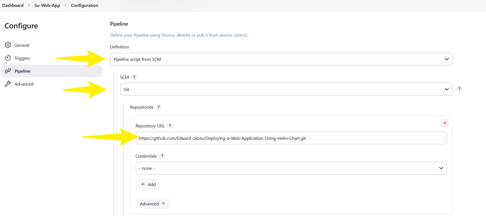

3. **Trigger Build on Commit**:
   - Set up a webhook on your Git repository that triggers Jenkins builds on push events.
     - Check the `GitHub hook trigger for GITScm polling`
     - `Apply` and `Save`

     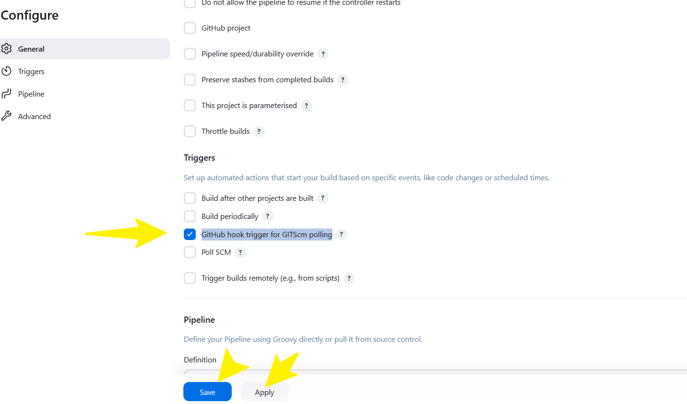

     - Configure the github repository to use the webhook trigger.
     - On your repository click `settings`> `Webhooks`> `Add Webhook`
     - **Payload URL**: http://172.31.64.1:8080/github-webhook/
     - **Content type** : application/json
     - **Secret** : Optionally, add a secret token
     - Select desired trigger events (e.g., push, merge requests).
   - Alternatively, use Jenkins' polling mechanism under **Build Triggers**:
     - Check the **Poll SCM** option and set a schedule (e.g., `H/5 * * * *` for every 5 minutes).
---

### **Step 4: Pipeline Script with Full Helm Path**
Use the given pipeline script in the `Jenkinsfile` located in your Git repository:

- Create a new `Jenkinsfile` in the root directory:

  ```
  nano Jenkinsfile
  ```
- Copy and paste your pipeline script into the `Jenkinsfile`:

    ```groovy
    pipeline {
        agent any
        stages {
            stage('Deploy with Helm') {
                steps {
                    bat 'C:\\ProgramData\\chocolatey\\bin\\helm upgrade --install my-webapp C:\\Users\\edwar\\Documents\\Myworkspace\\Deploying-a-Web-Application-Using-Helm-Chart\\helm-web-app\\webapp --namespace default'
                }
            }
        }
    }
    ```
 - Save the file (**Ctrl + O**, Enter) and exit (**Ctrl + X**) if using nano


**Key Points**:
1. The script ensures Helm uses the correct path (`/c/ProgramData/chocolatey/bin/helm`).
2. Adjust the namespace (`default`) and chart directory (`./webapp`-I used the absolute path to the webapp/) as needed.
3. Save the `Jenkinsfile` in your Git repository root for Jenkins to execute.

---

#### **Validation**
- After configuring the pipeline:
  - Commit and push your `Jenkinsfile` to the repository.
  - Trigger a manual build to ensure the pipeline runs smoothly.
  - Check the console logs in Jenkins to verify Helm is executing correctly.

  **NOTE** This build will fail because of no **AUTHENTICATION** between Jenkins and Kubernetes Cluster.
  Please refer to **Credential Challange** below to fix.

---

### **Step 5: Update Helm Chart and Trigger Jenkins Pipeline**

1. Update Helm Chart and Push changes.
- Edit the `values.yaml` in your `webapp` chart directory.
  - Change the `replicaCount` to `3` to increase the number of replicas
  - Save the changes

- Edit the `templates/deployment.yaml` File
  - Open `deployment.yaml` located in `templates` directory.
  - Locate the `resources` section under the `spec.template.spec.containers`
  - Update the resource request as follows.

    ```
    resources:
    requests:
        memory: "180Mi"
        cpu: "120m"
    ```
  - Save the file after making changes.

2. Commit and Push the Changes. 
- Use Git commands to commit these changes and push to remote repository.
- Execute these commands

    ```
    git add .
    git commit -m "Updated replicas, memory and CPU requests"
    git push
    ```

3. Jenkins Trigger Pipeline.
- Once you push the changes to the repository,the configured jenkins pipeline will detect the commit.
- Jenkins will then automatically start a new build, deploying your Helm chart with the new configurations. 

---

### **Credential Challenge**
The issue began when Jenkins pipeline failed during the Helm deployment stage with the error:  
**"Kubernetes cluster unreachable: Authentication required."**  

This happened because Jenkins was unable to authenticate with your Kubernetes cluster. Typically, Kubernetes requires credentials—either a kubeconfig file or an authentication token—to interact with the cluster API. While `kubectl` and `helm` worked manually on the system, Jenkins did not inherit the necessary authentication credentials to access the cluster.

---

#### **Resolution Process**
Systematic steps to resolve the issue:

1. **Identifying the Root Cause**:
   - Verified that Helm and kubectl were installed and functioning locally using:
     ```cmd
     helm version
     kubectl version
     ```
   - Checked Kubernetes connectivity manually with:
     ```cmd
     kubectl get nodes
     ```
   - This confirmed that the credentials required for cluster access were missing in Jenkins.

2. **Configuring Kubernetes Credentials for Jenkins**:
   - You added your kubeconfig file (located at `C:\Users\edwar\.kube\config`) as a **Secret file** in Jenkins:
     - Navigated to **Manage Jenkins** > **Manage Credentials** > **System** > **Global credentials**.
     - Uploaded the kubeconfig file and assigned it a credential ID (e.g., `kubeconfig-cred-id`).

3. **Referencing Kubeconfig in Your Pipeline**:
   - Modified the `Jenkinsfile` to include the `withCredentials` block, ensuring the kubeconfig file was correctly used during the pipeline execution:
     ```groovy
     pipeline {
         agent any
         stages {
             stage('Deploy with Helm') {
                 steps {
                     withCredentials([file(credentialsId: 'kubeconfig-cred-id', variable: 'KUBECONFIG')]) {
                         bat 'C:\\ProgramData\\chocolatey\\bin\\helm upgrade --install my-webapp C:\\Users\\edwar\\Documents\\Myworkspace\\Deploying-a-Web-Application-Using-Helm-Chart\\helm-web-app\\webapp --namespace default'
                     }
                 }
             }
         }
     }
     ```

4. **Testing and Validating**:
   - Triggered the pipeline again, and this time, Jenkins successfully authenticated with the cluster using the kubeconfig file.
   - The Helm command executed flawlessly, deploying your application to the Kubernetes cluster.
---

#### **Outcome**
This resolution allowed Jenkins to securely interact with your Kubernetes cluster, ensuring automation of the deployment process. 
---


#TEST:webhook

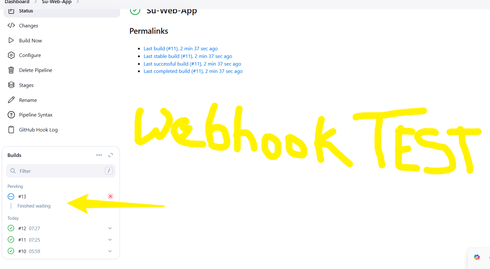
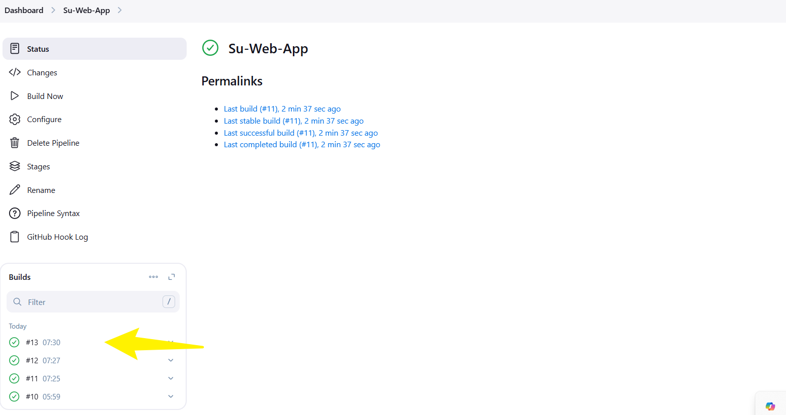


## TESTING

Some Test carried out while carrying out the project.
---

### **1. Environment Validation**
   - **Objective:** Verify Minikube is running and the Kubernetes cluster is accessible.
   - **Test:** Run `minikube status` and `kubectl get nodes` to confirm the cluster's readiness.

---

### **2. Helm Chart Linting**
   - **Objective:** Ensure the Helm chart files are free of syntax errors.
   - **Test:** Execute `helm lint <chart>` to validate the chart structure and configurations.

---

### **3. Jenkins Pipeline Test**
   - **Objective:** Verify that the Jenkins pipeline executes each stage correctly.
   - **Test:** Run the pipeline with a sample application to check build, deploy, and test stages.

---

### **4. Resource Validation**
   - **Objective:** Confirm resource limits and requests are applied to deployments correctly.
   - **Test:** Use `kubectl describe pod <pod-name>` to inspect pod specifications.

---

### **5. Deployment Verification**
   - **Objective:** Check whether the application is successfully deployed and running.
   - **Test:** Run `kubectl get deployments` and `kubectl get pods` to ensure the pod statuses are "Running."

---

### **6. Application Accessibility**
   - **Objective:** Test the accessibility of the application.
   - **Test:** Set up port-forwarding (`kubectl port-forward`) and verify access via `curl http://localhost:<port>`.

---

### **7. Automated Tests**
   - **Objective:** Validate application functionality with pre-configured test scripts.
   - **Test:** Execute automated tests (e.g., unit or integration tests) within the Jenkins pipeline.

---
